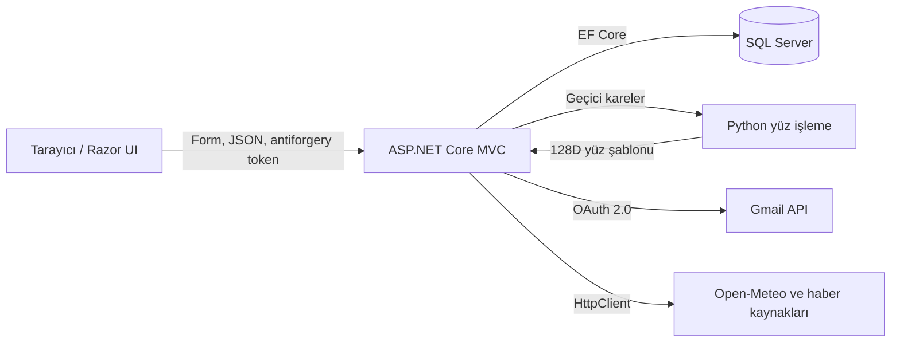
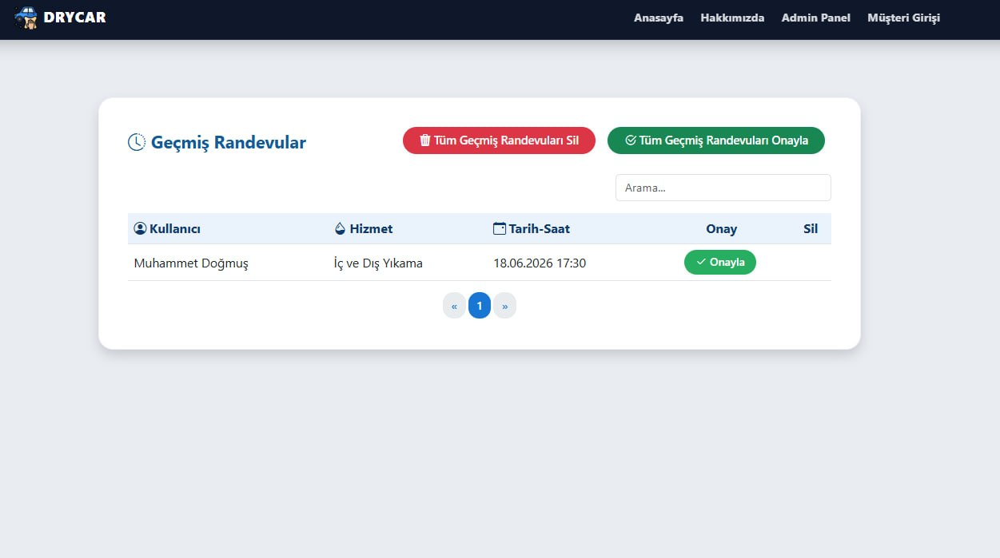
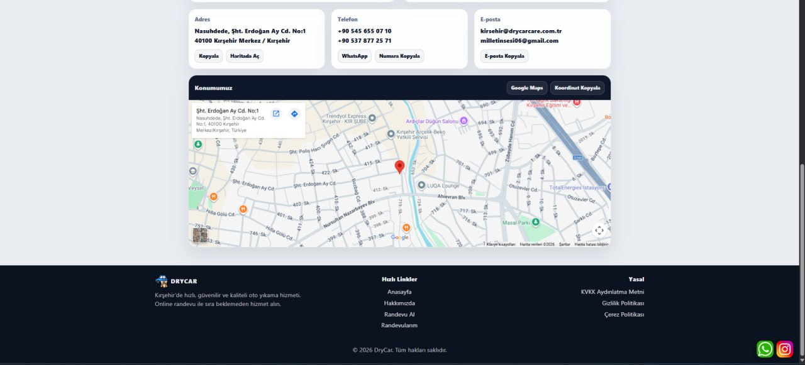

# DryCar Care

[](https://github.com/msaitdogmus/Car-Wash-website/actions/workflows/ci.yml)
[](https://dotnet.microsoft.com/)
[](https://learn.microsoft.com/ef/core/)
[](LICENSE)

Kırşehir'deki araç yıkama ve detaylı temizlik hizmetini dijitalleştiren randevu ve işletme yönetim uygulaması. Müşteri uygun günü ve saati seçip randevusunu oluşturabiliyor; işletme tarafı hizmetleri, fiyatları, kapasiteyi, geçmiş işlemleri ve hediye yıkama haklarını tek panelden yönetebiliyor.

<p align="center">
  <a href="https://drycarkirsehir.com.tr/"><strong>Canlı siteyi görüntüle</strong></a>
  ·
  <a href="docs/MIMARI.md"><strong>Teknik mimari</strong></a>
  ·
  <a href="docs/GUVENLIK_VE_YUZ_DOGRULAMA.md"><strong>Güvenlik ve yüz doğrulama</strong></a>
</p>


## Projenin çıkış noktası

Araç yıkamada en sık yaşanan sorunlardan biri yoğunluğu bilmeden işletmeye gitmek ve sıra beklemek. DryCar Care'de bu akışı baştan sona planlanabilir hale getirdik. Kullanıcı yalnızca boş saatleri görüyor; aynı hizmetin veya toplam işletme kapasitesinin dolduğu bir saat ikinci kez seçilemiyor.

Uygulama bir tanıtım sitesinden fazlası. Randevu oluşturma, müşteri hesabı, yönetim paneli, e-posta bildirimleri, hediye hakları, yerel hava durumu ve haberler aynı sistem içinde çalışıyor.

## Neler yapılabiliyor?

### Müşteri tarafı

- Hizmetleri ve güncel fiyatları inceleme
- Tarih, hizmet ve doluluk durumuna göre uygun saatleri görme
- Randevu oluşturma, düzenleme ve iptal etme
- Yaklaşan ve geçmiş randevuları ayrı takip etme
- Parola ile başlayan, yüz ve canlılık kontrolüyle tamamlanan giriş
- Tek kullanımlık bağlantıyla parola sıfırlama
- Kazanılan hediye yıkama haklarını ve sürelerini görme
- Kırşehir hava durumu ile yerel haberleri ana sayfadan takip etme

### İşletme tarafı

- Yaklaşan ve geçmiş randevuları yönetme
- Müşteri adına randevu oluşturma
- Randevu onaylama, güncelleme ve silme
- Hizmet ve fiyat ekleme, düzenleme ve kaldırma
- Tamamlanan işlemler üzerinden hediye yıkama döngüsünü yürütme
- Gmail üzerinden randevu ve hediye hakkı bildirimleri gönderme
- Gönderilemeyen bildirimleri uygulama içi kayıt olarak saklama

## Kullanılan teknolojiler

| Katman | Teknoloji | Projedeki görevi |
| --- | --- | --- |
| Backend | C#, .NET 8, ASP.NET Core MVC | HTTP akışı, oturum, iş kuralları ve yönetim paneli |
| Arayüz | Razor, HTML5, CSS3, Bootstrap, JavaScript | Sunucu tarafı sayfalar, kamera akışı ve duyarlı tasarım |
| Veri | Entity Framework Core 9, Microsoft SQL Server | İlişkisel veri modeli, sorgular ve migration yönetimi |
| Parola güvenliği | BCrypt.Net-Next | Parolaları salt içeren, maliyetli ve tek yönlü özetleme |
| Biyometri | Python, `face_recognition`, dlib, NumPy, OpenCV | Yüz bulma, 128 boyutlu yüz şablonu ve görüntü kalite kontrolü |
| Canlılık kontrolü | Yüz işaret noktaları ve EAR hesabı | Açık/kapalı göz geçişinden temel göz kırpma kontrolü |
| Biyometrik veri koruması | ASP.NET Core Data Protection | Yüz şablonunu veritabanına yazmadan önce koruma |
| E-posta | Gmail API, OAuth 2.0, MimeKit | Randevu ve hediye hakkı bildirimleri |
| Harici veriler | Open-Meteo, Google News RSS, AngleSharp | Hava durumu ve yerel haberlerin alınması |
| Yayın | Kestrel, systemd, Cloudflare Tunnel | Yerel servis, süreç yönetimi ve HTTPS erişimi |
| Otomasyon | GitHub Actions | Her push ve pull request'te Release derlemesi |

## Mimari



İstekler MVC denetleyicilerinde karşılanıyor. Veritabanı erişimi `ApplicationDbContext` üzerinden yapılıyor. Yüz doğrulama sırasında kamera kareleri yalnızca geçici klasöre yazılıyor; Python işlemi tamamlandığında `finally` bloğunda siliniyor. E-posta ve harici veri bağlantıları ayrı servislerde tutulduğu için denetleyiciler bu ayrıntıları taşımıyor.

Daha ayrıntılı sınıf ve akış açıklaması: [docs/MIMARI.md](docs/MIMARI.md)

## Randevu kapasitesi nasıl korunuyor?

Çalışma saatleri 07.00–19.30 arasında, 30 dakikalık slotlardan oluşuyor. Bir saat için iki ayrı sınır birlikte kontrol ediliyor:

1. Aynı saate toplam en fazla iki işlem yazılabilir.
2. Aynı hizmet aynı saatte yalnızca bir kez seçilebilir.

Bu kontrol hem kullanıcı randevusunda hem yönetici panelinde uygulanıyor. Düzenleme sırasında mevcut randevu sorgunun dışında bırakılıyor; böylece kayıt kendi kendisiyle çakışmıyor. Geçmiş zamanı seçme ve arşivlenmiş kaydı değiştirme de sunucu tarafında engelleniyor.

## Parola ve oturum güvenliği

Burada “şifreleme” ve “özetleme” ayrımını özellikle doğru kullanıyoruz. Parola geri çözülebilir biçimde şifrelenmiyor. BCrypt ile salt içeren tek yönlü bir özet oluşturuluyor ve veritabanında yalnızca bu özet tutuluyor. Kamu sürümünde iş faktörü `12` olarak açıkça belirlenmiş durumda.

Giriş iki aşamalı ilerliyor:

1. E-posta ve parola BCrypt ile doğrulanır.
2. Kullanıcı kimliği kısa süreli `PendingUserId` oturumuna alınır.
3. Yüz ve canlılık kontrolü başarılı olursa asıl kullanıcı oturumu açılır.
4. Bekleyen kimlik oturumdan silinir.

Oturum çerezi `HttpOnly`, `Secure`, `SameSite=Strict` ve `__Host-` önekiyle yapılandırıldı. Durum değiştiren MVC isteklerinde global antiforgery filtresi çalışıyor. JSON yüz doğrulama isteği de tokenı `RequestVerificationToken` başlığıyla gönderiyor.

## Yüz doğrulama nasıl çalışıyor?

Yüz tanıma kısmı yalnızca bir kütüphane çağrısından ibaret değil. Görüntünün kullanılabilir olduğundan ve kameranın karşısında canlı bir hareket gerçekleştiğinden emin olmak için birkaç aşama var:

1. Tarayıcı kameradan yaklaşık 3,5 saniyelik kısa bir kare dizisi alır.
2. Sunucu kare sayısını ve toplam veri boyutunu sınırlar.
3. Python tarafı her karede yüzleri bulur ve en büyük yüzü seçer.
4. Yüz alanı, parlaklık ve Laplacian varyansı üzerinden netlik kontrol edilir.
5. Göz işaret noktalarından Eye Aspect Ratio (EAR) hesaplanır.
6. Açık ve kapalı göz eşiğinin ikisinin de görülmesi göz kırpma olarak kabul edilir.
7. Seçilen net kareden dlib tabanlı 128 boyutlu yüz şablonu üretilir.
8. Kayıtlı ve güncel şablon arasındaki Öklid mesafesi hesaplanır; eşik `0.6` altındaysa eşleşme kabul edilir.
9. Geçici kareler sonuç ne olursa olsun silinir.

Kayıt sırasında ham fotoğraf veritabanına yazılmaz. Üretilen sayısal yüz şablonu ASP.NET Core Data Protection ile korunarak saklanır. Bu, biyometrik şablonun açık metin halde kalmasını önler. Üretimde Data Protection anahtar halkasının uygulama klasörü dışında, erişimi sınırlı ve yedekli tutulması gerekir.

Göz kırpma kontrolü temel bir sunum saldırısı önlemidir; yüksek güvenlikli kimlik doğrulama veya sertifikalı biyometrik sistem yerine geçmez. Tehdit modeli ve sınırlamalar [güvenlik belgesinde](docs/GUVENLIK_VE_YUZ_DOGRULAMA.md) açıkça anlatılıyor.

## Parola sıfırlama

- Token, kriptografik rastgele üreteçle 32 bayt olarak oluşturulur.
- Kullanıcıya Base64 URL biçimindeki ham token gönderilir.
- Veritabanında ham token değil, SHA-256 özeti tutulur.
- Bağlantı 30 dakika geçerlidir.
- Başarılı kullanımdan sonra token ve son kullanma zamanı temizlenir.
- Kayıtlı olmayan e-posta için de aynı genel yanıt dönülerek hesap keşfi zorlaştırılır.

## Gmail ve OAuth 2.0

`GmailApiEmailSender`, istemci kimliği, istemci sırrı ve yenileme tokenını yapılandırmadan alır. Yenileme tokenıyla kısa ömürlü erişim tokenı üretilir; ileti MimeKit ile hem HTML hem düz metin gövdeye sahip olacak şekilde hazırlanır ve Gmail API'nin istediği URL-safe Base64 biçiminde gönderilir.

Gerçek OAuth bilgileri repoda yoktur. Üretimde bu değerler ortam değişkeni veya bir secret manager üzerinden verilmelidir.

## Hediye yıkama sistemi

İç ve dış yıkama hizmetinde tamamlanıp yönetici tarafından onaylanan ücretli işlemler sayılır. Her üç ücretli işlemde bir hediye hakkı oluşturulur. Hakların bakiye, ayrılma, kullanılma ve son kullanma bilgileri kullanıcı üzerinde tutulur. Arka plan servisi yaklaşan süre sonlarını kontrol eder ve bildirim gönderir.

Bu akışın kritik bölümü, hakkın randevu oluşturulurken geçici ayrılması ve randevu iptal edilirse bakiyeye geri dönmesidir. Böylece aynı hak iki ayrı randevu için kullanılamaz.

## Proje yapısı

```text
.
├── .github/workflows/ci.yml
├── docs/
│   ├── MIMARI.md
│   ├── GUVENLIK_VE_YUZ_DOGRULAMA.md
│   └── screenshots/
├── src/DryCar/
│   ├── Controllers/       # Müşteri, randevu ve yönetim HTTP akışları
│   ├── Data/              # DbContext ve tasarım zamanı factory
│   ├── Migrations/        # SQL Server şema geçmişi
│   ├── Models/            # Kullanıcı, hizmet, randevu ve bildirim modelleri
│   ├── Services/          # E-posta, haber, hava, biyometri koruması ve worker'lar
│   ├── Views/             # Razor müşteri ve yönetim ekranları
│   ├── python/            # Yüz şablonu ve göz kırpma analizi
│   └── wwwroot/           # CSS, JavaScript ve görsel varlıklar
├── DryCar.sln
├── SECURITY.md
├── CONTRIBUTING.md
└── LICENSE
```

## Yerelde çalıştırma

### Gereksinimler

- .NET 8 SDK
- Microsoft SQL Server
- Python 3.11 önerilir
- C++ derleme araçları ve dlib'in gerektirdiği sistem paketleri
- Yüz doğrulama için kameralı ve HTTPS erişimli tarayıcı

### 1. Depoyu alın

```bash
git clone https://github.com/msaitdogmus/Car-Wash-website.git
cd Car-Wash-website
dotnet tool restore
dotnet restore DryCar.sln
```

### 2. Python ortamını hazırlayın

```bash
python3 -m venv .venv
source .venv/bin/activate
pip install -r src/DryCar/python/requirements.txt
```

### 3. Gizli ayarları tanımlayın

Gerçek değerleri `appsettings.json` içine yazıp commit etmek yerine user-secrets veya ortam değişkeni kullanın:

```bash
dotnet user-secrets --project src/DryCar set "ConnectionStrings:DefaultConnection" "SQL_SERVER_CONNECTION_STRING"
dotnet user-secrets --project src/DryCar set "PythonConfig:ExecutablePath" "$(pwd)/.venv/bin/python"
dotnet user-secrets --project src/DryCar set "Gmail:ClientId" "..."
dotnet user-secrets --project src/DryCar set "Gmail:ClientSecret" "..."
dotnet user-secrets --project src/DryCar set "Gmail:RefreshToken" "..."
```

Yapılandırma şeması için [appsettings.example.json](src/DryCar/appsettings.example.json) dosyasına bakın. Ortam değişkenlerinde `:` yerine çift alt çizgi kullanılır: `Gmail__ClientId`, `PythonConfig__ExecutablePath` gibi.

### 4. Veritabanını hazırlayın

```bash
dotnet ef database update --project src/DryCar
```

İlk yönetici isteğe bağlı olarak `AdminSeed__Username` ve `AdminSeed__Password` ile oluşturulabilir. Hesap oluştuktan sonra parola değişkenini ortamdan kaldırın.

### 5. Uygulamayı başlatın

```bash
dotnet run --project src/DryCar
```

Tarayıcı kamera API'si güvenli bağlam istediği için yüz doğrulamayı HTTPS üzerinde test edin.

## Yapılandırma özeti

| Anahtar | Zorunlu | Açıklama |
| --- | --- | --- |
| `ConnectionStrings__DefaultConnection` | Evet | SQL Server bağlantısı |
| `App__BaseUrl` | E-posta için | Parola sıfırlama bağlantısının taban adresi |
| `PythonConfig__ExecutablePath` | Yüz doğrulama için | Sanal ortamdaki Python çalıştırıcısı |
| `PythonConfig__ScriptPath` | Yüz doğrulama için | `extract_vector.py` yolu |
| `PythonConfig__ModelType` | Hayır | `hog` veya `cnn`; varsayılan `hog` |
| `Gmail__FromEmail` | E-posta için | Gönderici Gmail hesabı |
| `Gmail__ClientId` | E-posta için | OAuth istemci kimliği |
| `Gmail__ClientSecret` | E-posta için | OAuth istemci sırrı |
| `Gmail__RefreshToken` | E-posta için | Gmail gönderim yetkili yenileme tokenı |
| `AdminSeed__Username` | Hayır | İlk yönetici kullanıcı adı |
| `AdminSeed__Password` | Hayır | İlk çalıştırmadan sonra kaldırılacak parola |

## Güvenlik özeti

- BCrypt iş faktörü 12 ile parola özeti
- Data Protection ile korunan yüz şablonları
- SHA-256 özeti saklanan, 30 dakikalık parola sıfırlama tokenı
- HttpOnly, Secure, SameSite ve `__Host-` kurallarına uygun oturum çerezi
- Durum değiştiren isteklerde otomatik antiforgery doğrulaması
- Kare başına ve toplam yüz verisi için istek boyutu sınırı
- Web kökünün dışında geçici yüz dosyaları ve kesin temizlik
- Parametreli EF Core sorguları
- Gizli ayarların repodan ayrılması
- HSTS, HTTPS yönlendirmesi ve temel güvenlik başlıkları
- IP başına giriş ve yüz doğrulama oran sınırlaması
- Üretimde kapalı ayrıntılı yüz tanıma tanıları

Güvenlik açığı bildirme yöntemi için [SECURITY.md](SECURITY.md) dosyasına bakın.

## Ekran görüntüleri

| Canlı bilgi paneli | Hakkımızda |
| --- | --- |
|  |  |

| Randevu oluşturma | Randevularım |
| --- | --- |
|  |  |

| Admin randevu ekleme | Hizmet yönetimi |
| --- | --- |
|  |  |





## Açık kaynak ve veri sınırı

Bu depo, üretimdeki DryCar Care uygulamasının güvenli açık kaynak sürümüdür. Uygulama kodu, iş kuralları, yüz doğrulama algoritması, veri modeli, migration'lar ve ana arayüz akışları paylaşılmıştır. Aşağıdakiler bilinçli olarak repoya alınmaz:

- Gerçek parola, API anahtarı, OAuth tokenı veya bağlantı cümlesi
- Müşteri ve randevu kayıtları
- Yüz fotoğrafı veya gerçek biyometrik şablon
- Üretim sunucusuna özel servis hesapları ve Cloudflare kimlik bilgileri
- Yedek veri tabanları, loglar ve hata dökümleri

## Katkı ve lisans

Katkı süreci [CONTRIBUTING.md](CONTRIBUTING.md) dosyasında anlatılıyor. Proje [MIT Lisansı](LICENSE) ile paylaşılmaktadır.
