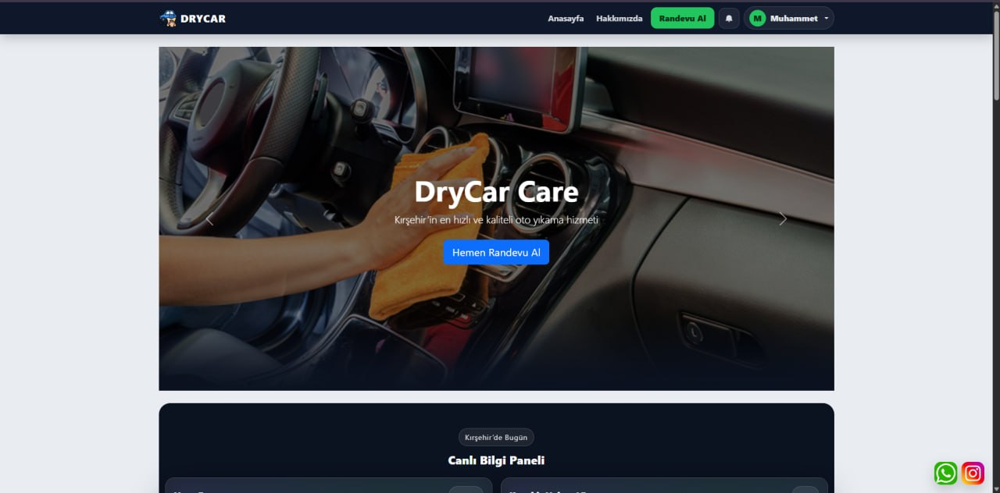
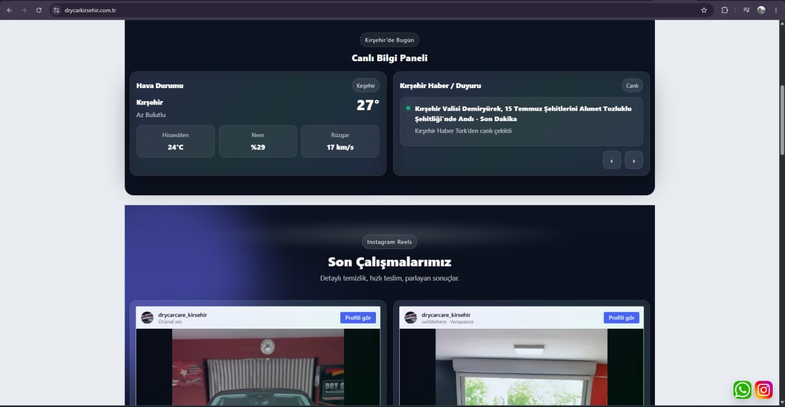
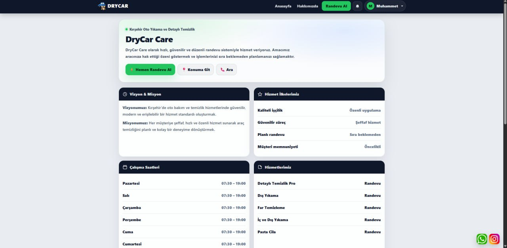
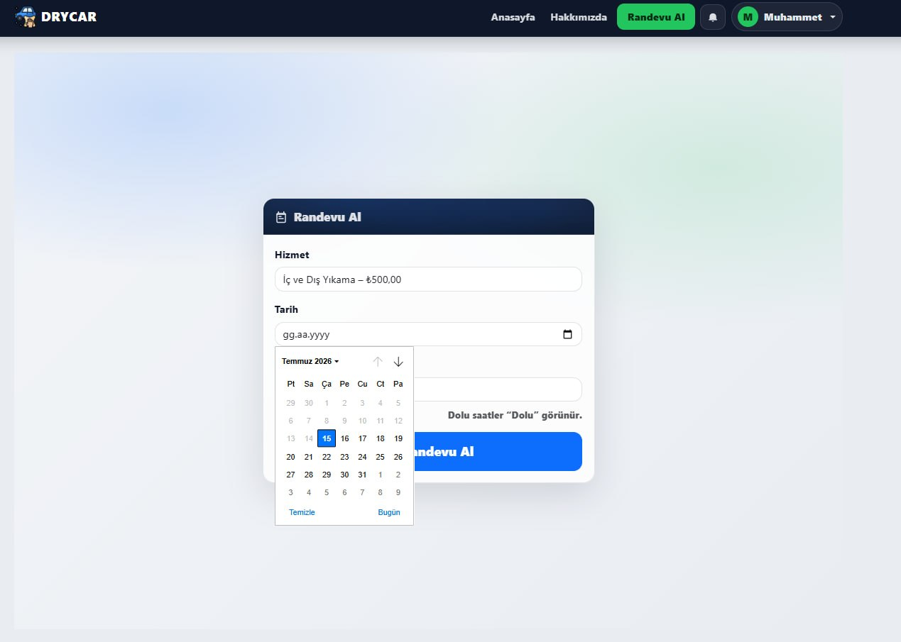
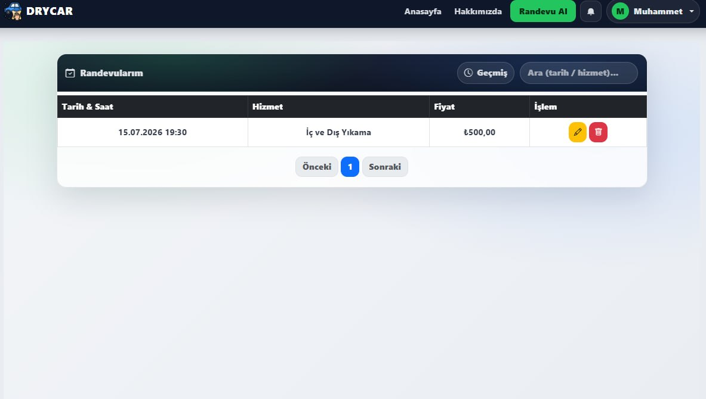
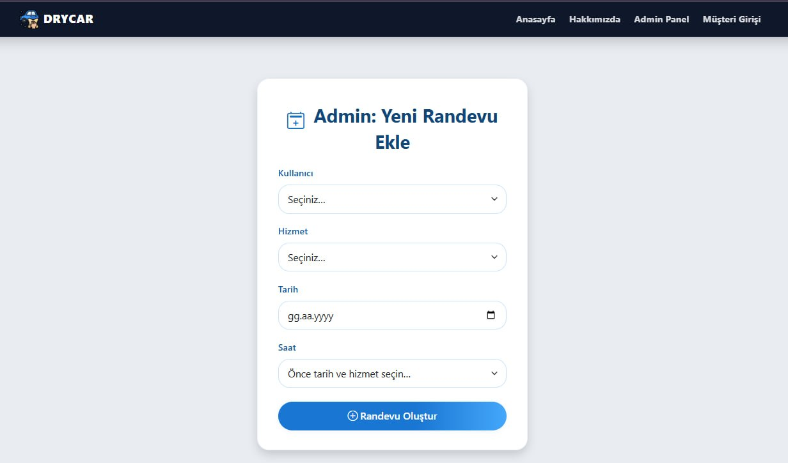
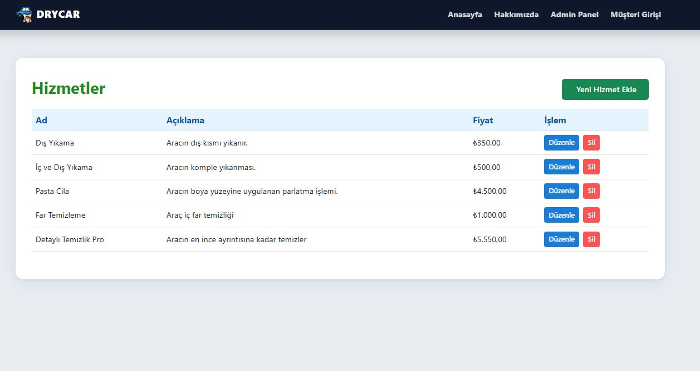

<div align="center">
  
  <h1>DryCar Care</h1>
  <p><strong>A clean car without the waiting.</strong></p>
  <p>A car wash appointment and business management platform built for DryCar Care in Kırşehir, Türkiye.</p>

  <p>
    <a href="https://drycarkirsehir.com.tr/"></a>
  </p>

  <p>
    
    
    
    
    
    <a href="https://github.com/msaitdogmus/Car-Wash-website/actions/workflows/ci.yml"></a>
    
  </p>
</div>



## About the platform

DryCar Care lets customers choose a service, date and available time before visiting the business. The booking engine shows only valid time slots and prevents a service or the overall wash capacity from being booked twice. This reduces phone-based scheduling, avoids unnecessary waiting and gives the business one place to manage its daily workload.

The project is more than a landing page. Customer accounts, two-step sign-in, appointment management, an administration panel, service and price management, free-wash rewards, email notifications, local weather and Kırşehir news all work together in one application.

### Highlights

- Availability-based appointment booking
- Separate upcoming and past appointment views
- Appointment editing and cancellation
- Password and face verification as a two-step sign-in flow
- Basic blink-based liveness check through the browser camera
- Secure, single-use password reset links
- Appointment, service, price and customer management for administrators
- Free-wash rewards based on completed services
- Gmail API notifications for appointments and rewards
- Kırşehir weather data powered by Open-Meteo
- Local news feeds with Google News RSS fallback
- Responsive Razor interface for desktop and mobile devices

## Screenshots

<p align="center">
  
  
</p>

<p align="center">
  
  
</p>

<p align="center">
  
  
</p>

## Technology stack

| Area | Technology | Responsibility |
| --- | --- | --- |
| Application framework | .NET 8 and ASP.NET Core MVC | HTTP flow, sessions, business rules and the administration panel |
| Language | C# | Backend logic, data access and integrations |
| User interface | Razor, HTML5, CSS3, Bootstrap and JavaScript | Server-rendered pages, camera interaction and responsive design |
| Database | Microsoft SQL Server | Customer, service, appointment and notification data |
| Data access | Entity Framework Core 9 | Models, queries, relationships and database migrations |
| Password security | BCrypt.Net-Next | Salted and deliberately expensive one-way password hashing |
| Face processing | Python, face_recognition, dlib, OpenCV and NumPy | Face detection, image quality checks and 128-dimensional face descriptors |
| Liveness check | Facial landmarks and Eye Aspect Ratio | Basic open-eye and closed-eye transition detection |
| Biometric protection | ASP.NET Core Data Protection | Protecting face descriptors before database storage |
| Email | Gmail API, OAuth 2.0 and MimeKit | Appointment and free-wash notifications |
| External data | Open-Meteo, Google News RSS and AngleSharp | Weather and local news |
| Hosting | Kestrel, systemd and Cloudflare Tunnel | Application process, HTTPS and public access |
| Continuous integration | GitHub Actions | Release build and Python syntax verification on every change |

## Architecture

DryCar Care follows a conventional ASP.NET Core MVC structure. Razor pages are rendered on the server, while JavaScript is limited to interactive features such as the camera, available-time requests, weather and news. Entity Framework Core handles SQL Server access. Face processing, Gmail and external data sources live behind dedicated services so that controllers do not need to know their implementation details.

```text
Browser and Razor interface
            │
ASP.NET Core MVC controllers
            │
Application services and business rules
      ┌─────┴──────────────┬──────────────────┐
      │                    │                  │
EF Core / SQL Server   Python face engine   External services
                                              │
                                      Gmail, weather and news
```

The main areas of the source tree are:

- [`Controllers`](src/DryCar/Controllers): account, appointment, administration and home-page request flows
- [`Models`](src/DryCar/Models): users, services, appointments, notifications and external-data models
- [`Data`](src/DryCar/Data): `ApplicationDbContext` and Entity Framework configuration
- [`Migrations`](src/DryCar/Migrations): SQL Server schema history and supporting indexes
- [`Services`](src/DryCar/Services): Gmail, protected face descriptors, weather, news and background jobs
- [`Views`](src/DryCar/Views): customer and administrator Razor pages
- [`python`](src/DryCar/python): face descriptor extraction and blink analysis
- [`wwwroot`](src/DryCar/wwwroot): styles, browser scripts and visual assets

## How the main flows work

### Appointment availability and capacity

The customer flow is implemented in [`AppointmentController.cs`](src/DryCar/Controllers/AppointmentController.cs). Working hours are divided into 30-minute slots between 07:00 and 19:30. When a customer selects a service and date, two rules are evaluated for every slot:

1. No more than two active appointments may occupy the same time.
2. The same service may only be booked once at the same time.

Filtering in the browser is never treated as authoritative. The server repeats the checks when an appointment is created or edited. Writes run inside serializable transactions, and a database index prevents a second active appointment for the same service and time. Administrator-created appointments follow the same rules.

### Password storage

Passwords are not encrypted in a reversible form. [`AccountController.cs`](src/DryCar/Controllers/AccountController.cs) hashes each password with BCrypt and an explicit work factor of `12`. BCrypt generates a random salt for every password and stores the salt parameters inside the resulting hash. Only that result is written to the database.

```csharp
var passwordHash = BCrypt.Net.BCrypt.HashPassword(password, workFactor: 12);
var isValid = BCrypt.Net.BCrypt.Verify(candidatePassword, passwordHash);
```

The application therefore cannot recover a customer's original password. During sign-in, BCrypt verifies the submitted candidate against the saved hash. Session cookies are configured with `HttpOnly`, `Secure`, `SameSite=Strict` and a `__Host-` prefix. State-changing form requests use antiforgery validation, and authentication endpoints have per-IP rate limits.

### Password reset

A password reset token starts as 32 random bytes generated by `RandomNumberGenerator`. The URL-safe raw value is sent to the customer, while only its SHA-256 digest is stored in the database. A link remains valid for 30 minutes and is cleared immediately after a successful reset. Possession of the database value alone is therefore not enough to reset an account.

### Face verification

The browser-side [`face-verification.js`](src/DryCar/wwwroot/js/face-verification.js) captures a short sequence of camera frames. The server validates the data type, frame count and total request size before writing temporary images outside the public web root. [`extract_vector.py`](src/DryCar/python/extract_vector.py) processes the frames in the following order:

1. Detect faces and select the largest one when several are visible.
2. Reject a face region that is too small.
3. Measure brightness and blur using the variance of the Laplacian.
4. Calculate Eye Aspect Ratio from six landmarks around each eye.
5. Treat an open-eye to closed-eye transition as a basic blink signal.
6. Produce a 128-dimensional dlib face descriptor from the best usable frame.
7. Calculate the Euclidean distance between the saved and current descriptors.
8. Accept the match when the distance is below `0.6`.
9. Delete all temporary frames in a `finally` block, regardless of the result.

```text
EAR = (|p2-p6| + |p3-p5|) / (2 × |p1-p4|)

distance = sqrt(Σ(saved[i] - current[i])²)
```

The registration process does not store the original face photograph in the database. [`FaceVectorProtector.cs`](src/DryCar/Services/FaceVectorProtector.cs) protects the numeric descriptor with ASP.NET Core Data Protection before persistence. A correct password does not immediately create a signed-in session: the account is kept in a short-lived pending state until face and liveness verification succeeds.

Blink detection is a basic presentation-attack defence. It is not a replacement for certified biometric verification and is not designed to defeat advanced replay, mask or deepfake attacks.

### Free-wash rewards

Paid interior and exterior washes count after an administrator confirms their completion. Every three eligible services create a free-wash reward. The reward is reserved when an appointment is made, returned to the balance if that appointment is cancelled and consumed permanently after completion. This prevents one reward from being attached to two appointments.

[`FreeDealReminderWorker.cs`](src/DryCar/Services/FreeDealReminderWorker.cs) checks expiring rewards in the background. A temporary email failure does not roll back the main appointment transaction; the application creates an in-app notification instead.

### Gmail and OAuth 2.0

[`GmailApiEmailSender.cs`](src/DryCar/Services/GmailApiEmailSender.cs) reads the client ID, client secret and refresh token from protected configuration. It exchanges the refresh token for a short-lived access token, creates HTML and plain-text bodies with MimeKit and sends the URL-safe Base64 message through the Gmail API.

OAuth credentials, the SQL connection string and the initial administrator password are not stored in source control. Local development should use .NET user secrets; production should use environment variables or a managed secret store.

### Weather and local news

[`KirsehirWeatherService.cs`](src/DryCar/Services/KirsehirWeatherService.cs) maps Open-Meteo data into the application's weather model. Several news services read local sources, with Google News RSS available as a fallback. If an external service is unavailable, the home page displays its empty state instead of failing the main request.

## Source availability and reconstruction notes

This repository is a publishable source reconstruction of the deployed DryCar Care application, not a byte-for-byte copy of its original development repository.

- C# controllers, models, services and application configuration were recovered from the application's compiled .NET assembly and reorganized into a buildable solution.
- Public static assets and the Python face-processing module were collected from the deployed application output.
- Original `.cshtml` source files are not preserved inside a compiled .NET assembly. The Razor views in this repository were recreated from the available routes, view models, browser assets and live-screen references. They represent the application flows but should not be treated as the exact original view source.
- Compiler-generated formatting, comments and some original symbol names cannot be recovered reliably from a compiled binary.
- Database migrations required for the public security and capacity changes were added to the reconstructed solution.
- The live production directory was not modified while preparing this repository.

The repository contains 93 tracked files under `src/DryCar`, including the backend, data model, migrations, services, 29 Razor views, browser assets and the Python face engine. It is intended to be readable and buildable, but it must not be described as the untouched original source tree.

## Project structure

```text
Car-Wash-website/
|-- .github/workflows/ci.yml
|-- docs/screenshots/
|-- src/DryCar/
|   |-- Controllers/
|   |-- Data/
|   |-- Migrations/
|   |-- Models/
|   |-- Services/
|   |-- Views/
|   |-- python/
|   |-- wwwroot/
|   |-- appsettings.example.json
|   `-- DryCar.csproj
|-- LICENSE
`-- README.md
```

## Local development

### Requirements

- .NET 8 SDK
- Microsoft SQL Server
- Python 3.11
- C++ build tools required by dlib
- A camera-enabled browser with HTTPS access for face verification

### Prepare the project

```bash
git clone https://github.com/msaitdogmus/Car-Wash-website.git
cd Car-Wash-website

dotnet tool restore
dotnet restore src/DryCar/DryCar.csproj

python3 -m venv .venv
source .venv/bin/activate
pip install -r src/DryCar/python/requirements.txt
```

### Configuration

Use .NET user secrets instead of committing real credentials:

```bash
dotnet user-secrets --project src/DryCar set "ConnectionStrings:DefaultConnection" "SQL_SERVER_CONNECTION_STRING"
dotnet user-secrets --project src/DryCar set "PythonConfig:ExecutablePath" "$(pwd)/.venv/bin/python"
dotnet user-secrets --project src/DryCar set "Gmail:ClientId" "..."
dotnet user-secrets --project src/DryCar set "Gmail:ClientSecret" "..."
dotnet user-secrets --project src/DryCar set "Gmail:RefreshToken" "..."
```

[`appsettings.example.json`](src/DryCar/appsettings.example.json) documents every supported configuration key with safe placeholders. An initial administrator may optionally be created through `AdminSeed__Username` and `AdminSeed__Password`. Remove the seed password from the environment after the account is created.

### Database and startup

```bash
dotnet ef database update --project src/DryCar
dotnet run --project src/DryCar
```

Browser camera APIs require a secure context, so face verification should be tested over HTTPS.

## Security and repository scope

The repository includes the application logic, data model, migrations, Razor interfaces and face-processing algorithm. The following production data is deliberately excluded:

- Customer, appointment and biometric records
- Passwords and administrator credentials
- SQL Server connection strings
- Gmail client secrets and OAuth refresh tokens
- Cloudflare Tunnel credentials
- ASP.NET Core Data Protection keys
- Server logs, database backups and build outputs

Only [`appsettings.example.json`](src/DryCar/appsettings.example.json) is tracked, and it contains configuration names with non-secret placeholders.

## License

The published source code is available under the [MIT License](LICENSE). The DryCar Care name, brand assets and real business data are not granted under that license.

---

<div align="center">
  <a href="https://drycarkirsehir.com.tr/">Visit the DryCar Care website</a>
</div>
