

# DryCar Care

### Kırşehir için geliştirdiğim uçtan uca oto yıkama ve randevu platformu

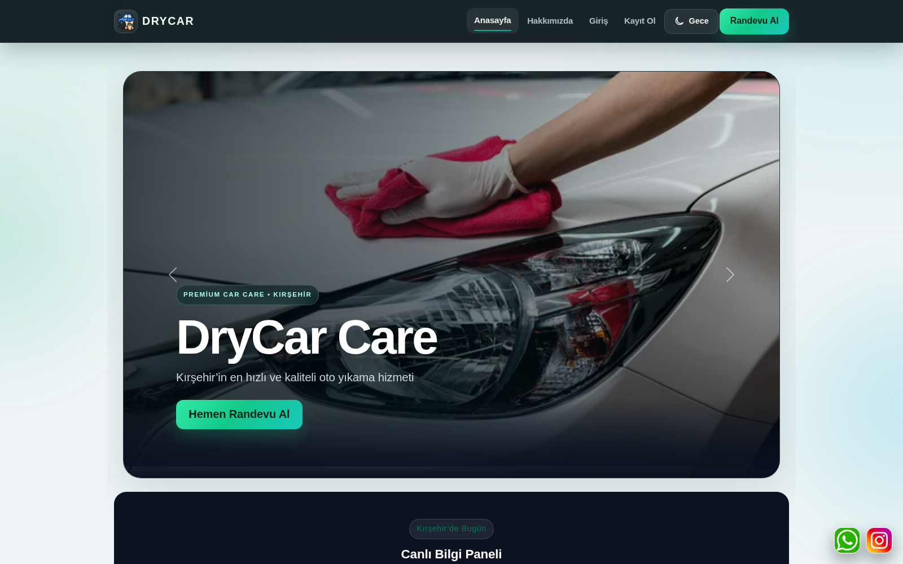

## Kısaca proje

DryCar Care’i yalnızca güzel görünen bir tanıtım sitesi olarak değil, işletmenin günlük operasyonunu taşıyan gerçek bir ürün olarak geliştirdim. Müşteri hizmet, gün ve uygun saat seçerek randevu alabiliyor; işletme tarafı ise randevuları, hizmetleri, fiyatları ve geçmiş işlemleri tek panelden yönetebiliyor.

Projede ürün tasarımından responsive arayüze, iş kurallarından veritabanına, güvenlikten production yayınına kadar bütün süreci üstlendim. Canlı sistem ASP.NET Core, SQL Server, Python tabanlı yüz işleme ve Cloudflare altyapısıyla çalışıyor.

> Bu depo bilinçli olarak bir **ürün vaka çalışmasıdır**. Production uygulamasının tamamı public değildir. Burada güncel ekranlar, mimari kararlar, doğrulanmış test sonuçları ve yaklaşımı gösterecek kadar küçük kod örnekleri bulunur.

## Ortaya çıkan ürün

| Müşteri deneyimi | İşletme operasyonu | Platform altyapısı |
| --- | --- | --- |
| Üyelik ve güvenli oturum açma | Yaklaşan/geçmiş randevu yönetimi | ASP.NET Core MVC ve SQL Server |
| Canlı uygunlukla randevu alma | Hizmet ve fiyat yönetimi | Cloudflare Tunnel üzerinden HTTPS |
| Randevu düzenleme ve iptal | Yönetici adına randevu oluşturma | Gmail API bildirimleri |
| Parola + yüz/canlılık doğrulaması | Tamamlanan hizmet ve ödül takibi | Python, OpenCV, dlib ve face_recognition |
| Açık/koyu tema ve mobil arayüz | Mobil uyumlu yönetim tabloları | Hava durumu ve yerel haber entegrasyonları |

## Tasarım yaklaşımı

Arayüzü otomotiv sektörüne uygun koyu lacivert, grafit, turkuaz ve yeşil tonlarıyla yeniden tasarladım. Aynı görsel dil ana sayfadan üyeliğe, yüz doğrulamadan yönetim paneline kadar devam ediyor.

- Tek tasarım sistemi: ortak renkler, yüzeyler, boşluklar, butonlar ve form alanları
- Masaüstü ve mobil için ayrı düşünülmüş responsive davranış
- Mobilde tablo satırlarını okunabilir kartlara dönüştüren yapı
- Kullanıcının seçimini hatırlayan açık/koyu tema
- Klavye odağı, anlamlı alan etiketleri ve azaltılmış hareket tercihi desteği
- İlk ziyarette deneyimi kapatmayan daha kompakt çerez tercih ekranı

  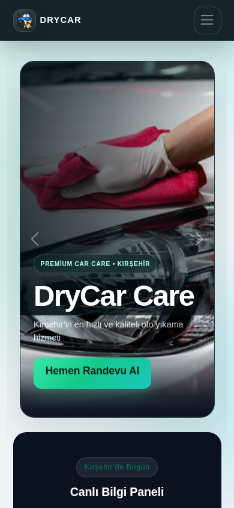
  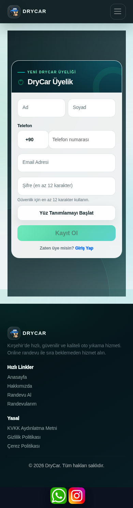
  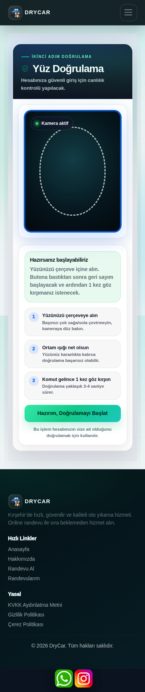

## Temel kullanıcı akışları

### Müşteri

1. Müşteri hesap oluştururken iletişim bilgilerini ve yüz tanımını kaydeder.
2. Parola doğrulandıktan sonra canlılık/yüz kontrolü ikinci adım olarak çalışır.
3. Hizmet ve tarih seçildiğinde yalnızca gerçekten uygun saatler gösterilir.
4. Randevu sunucuda tekrar doğrulanır; dolu saat yalnız tarayıcıya güvenilerek kabul edilmez.
5. Müşteri yaklaşan ve geçmiş randevularını ayrı ekranlarda takip eder.

### Yönetici

1. Yönetici kendine ayrılmış, hız sınırlamalı girişten panele ulaşır.
2. Randevuları arayabilir; oluşturabilir, düzenleyebilir ve geçmişe taşıyabilir.
3. Hizmet açıklamalarını ve fiyatları aynı panelden yönetebilir.
4. Tamamlanan uygun işlemler ödül/ücretsiz yıkama döngüsüne yansır.

  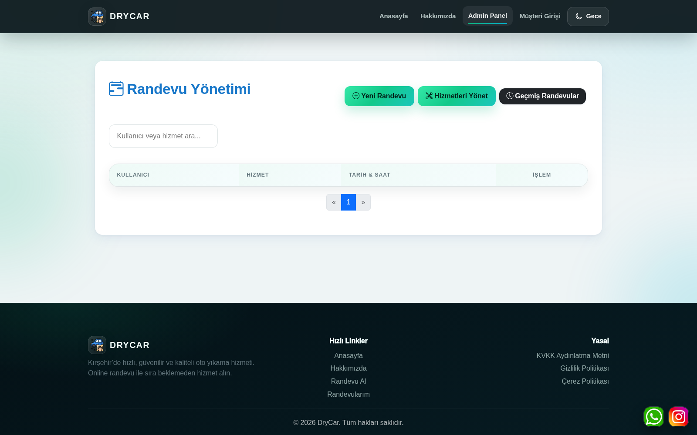
  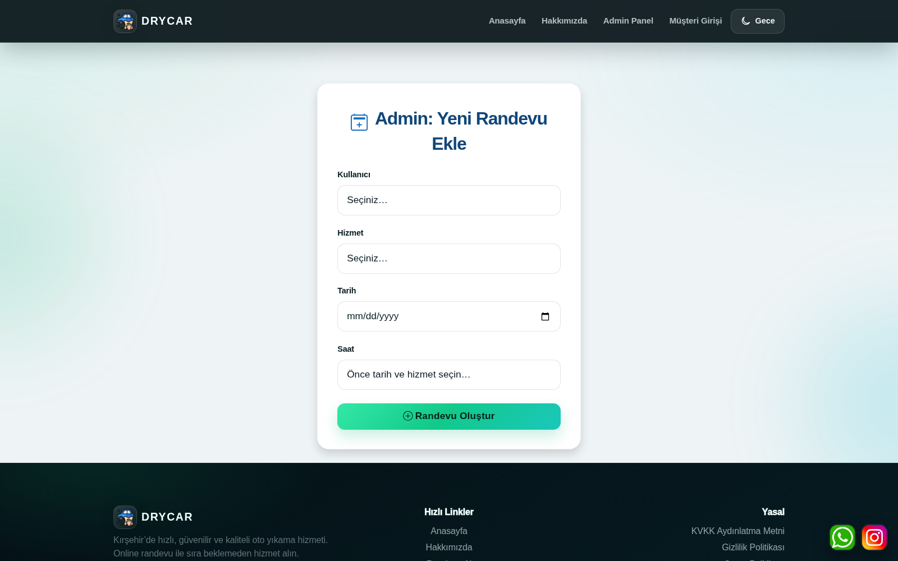

## Mimari

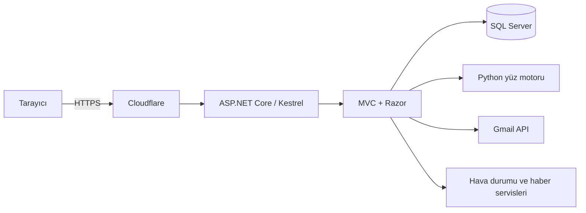
```mermaid
flowchart LR
    U[Tarayıcı] -->|HTTPS| CF[Cloudflare]
    CF --> K[ASP.NET Core / Kestrel]
    K --> MVC[MVC + Razor]
    MVC --> DB[(SQL Server)]
    MVC --> PY[Python yüz motoru]
    MVC --> GM[Gmail API]
    MVC --> EXT[Hava durumu ve haber servisleri]
```

Uygulamada tarayıcı yalnız etkileşim ve kamera yakalama işlerini üstleniyor. Randevu kapasitesi, oturum, yetki, parola ve kayıt kuralları sunucu tarafında tekrar uygulanıyor. Ayrıntılı anlatım için [mimari notlarına](docs/architecture.md) bakabilirsin.

## Güvenlik yaklaşımı

Güvenliği sonradan eklenen tek bir özellik olarak değil, girişten veri saklamaya kadar katmanlı bir sistem olarak ele aldım.

- Parolalar BCrypt work factor `12` ile tek yönlü hashleniyor.
- Oturum çerezi `HttpOnly`, `Secure`, `SameSite=Strict` ve `__Host-` kurallarıyla sınırlandırılıyor.
- Durum değiştiren formlar antiforgery doğrulamasından geçiyor.
- Sunucu, POST isteklerinde beklenmeyen `Origin`/`Referer` kaynaklarını reddediyor.
- Giriş, yüz doğrulama ve genel trafik için ayrı hız limitleri bulunuyor.
- CSP, HSTS, `frame-ancestors`, MIME sniffing ve Permissions Policy başlıkları uygulanıyor.
- Yüz fotoğrafı kalıcı olarak tutulmuyor; biyometrik vektör Data Protection ile korunuyor.
- Geçici yüz kareleri işlem başarılı ya da hatalı olsa da temizleniyor.
- SQL bağlantısı, e-posta tokenları ve production anahtarları kaynak koddan ayrı tutuluyor.

Tehdit modeli ve alınan önlemler: [Güvenlik notları](docs/security.md)

## Son doğrulama sonuçları

8 Ağustos 2026 tarihinde canlı production sistemi üzerinde yaptığım son regresyon:

| Kontrol | Sonuç |
| --- | --- |
| 10 public rota × masaüstü/mobil | 20/20 başarılı HTTP yanıtı |
| Yetkili yönetim ekranları | 5/5 başarılı |
| Müşteri parola → yüz doğrulama geçişi | Başarılı |
| Yatay taşma | 0 sayfa |
| Tarayıcı konsol hatası | 0 |
| Kaynak derleme | 0 hata, 0 uyarı |
| Cross-origin sahte POST | `403 Forbidden` |
| Yetkisiz müşteri randevu sayfası | Giriş ekranına `302` yönlendirme |
| Güvenlik başlıkları | CSP, HSTS, nosniff, DENY ve Permissions Policy aktif |

Testler için oluşturulan geçici yönetici ve müşteri kayıtları doğrulama sonunda silindi. Ayrıntılar ve kapsam: [Test raporu](docs/testing.md)

## Seçilmiş kod örnekleri

Public depoda production kodunun tamamı yerine üç küçük, bağımsız örnek bıraktım:

- [Randevu kapasite politikası](samples/BookingCapacityPolicy.cs)
- [ASP.NET Core güvenlik profili](samples/SecurityProfile.cs)
- [Basit canlılık ve yüz eşleştirme akışı](samples/face_liveness_pipeline.py)

Bu dosyalar yaklaşımı okunabilir biçimde göstermek için sadeleştirilmiştir; canlı sistemin kopyası veya kurulabilir kaynak paketi değildir.

## Teknolojiler

`C#` · `.NET 8` · `ASP.NET Core MVC` · `Razor` · `Entity Framework Core` · `SQL Server` · `Python` · `OpenCV` · `dlib` · `face_recognition` · `Gmail API` · `Cloudflare Tunnel` · `Bootstrap` · `JavaScript`

## Daha fazla ekran

  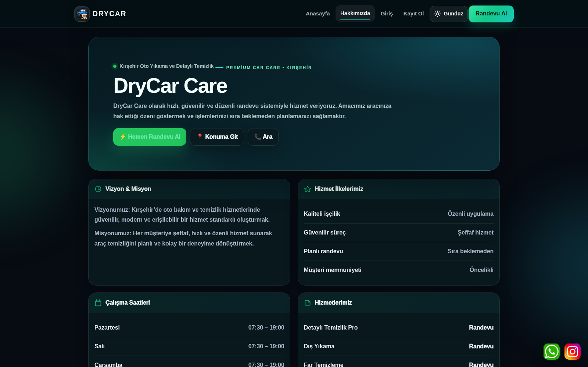
  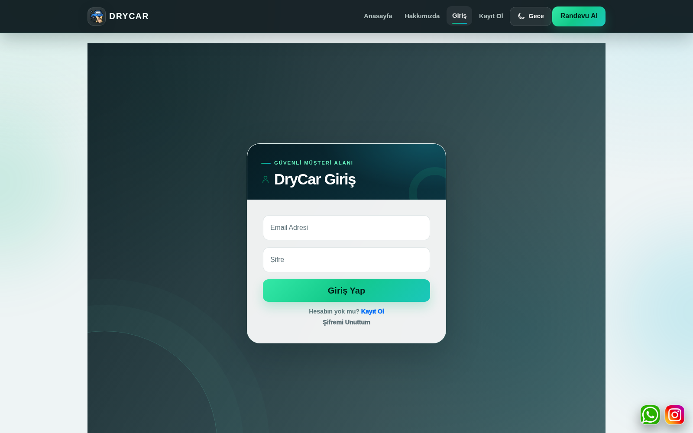

  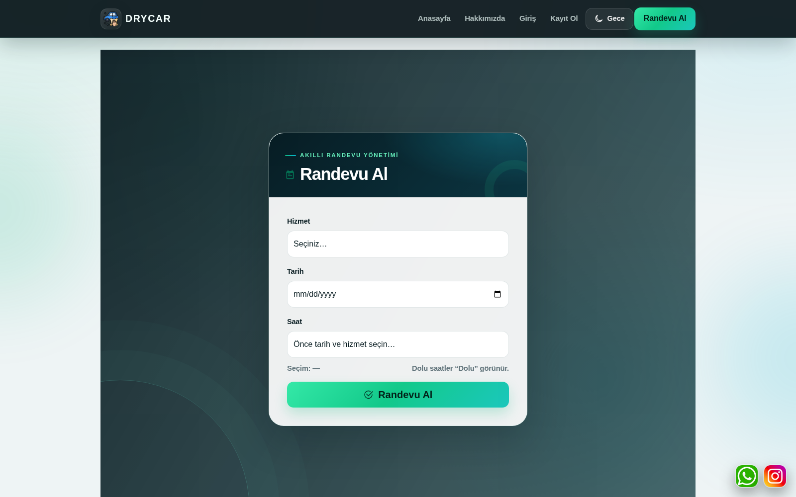
  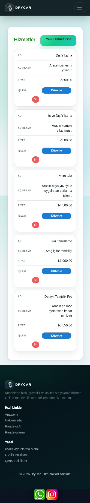

---

Canlı ürünü incelemek için: **[drycarkirsehir.com.tr](https://drycarkirsehir.com.tr/)**

