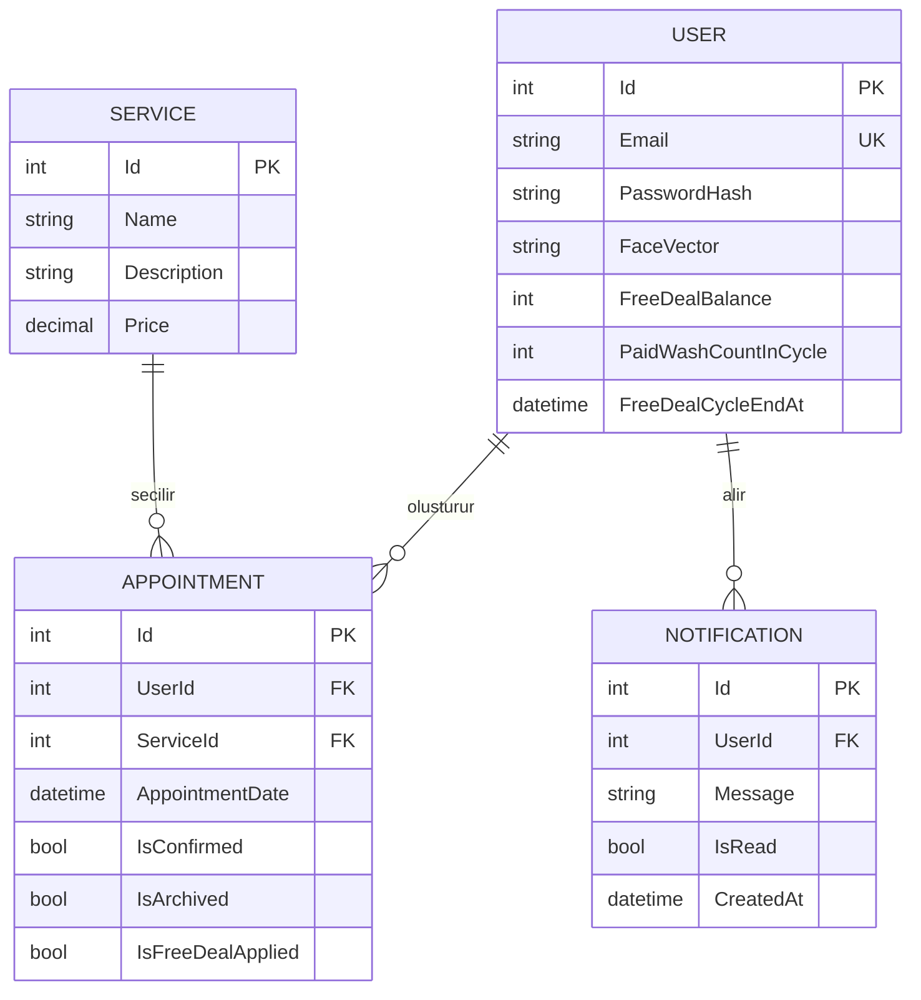
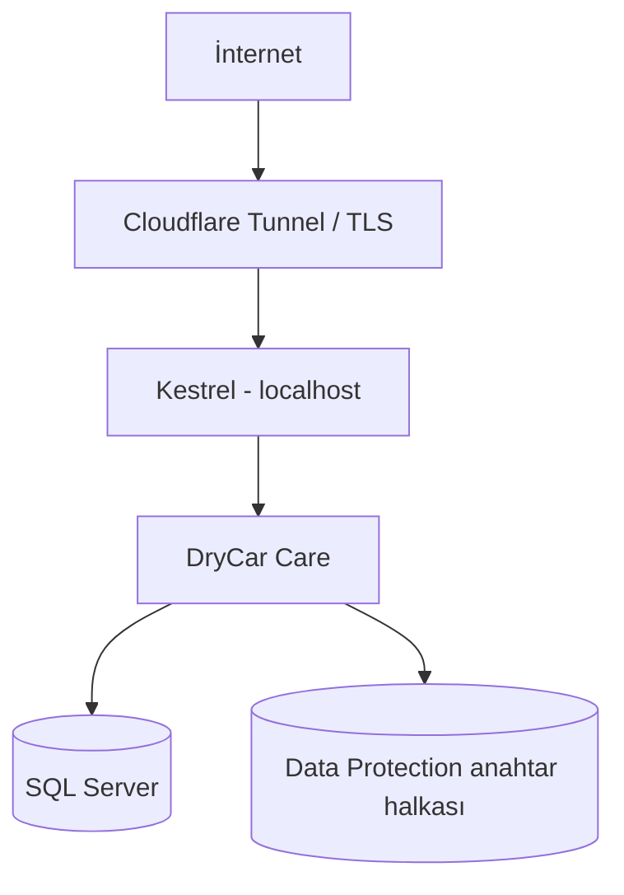

# DryCar Care teknik mimarisi

Bu belge uygulamanın hangi parçalardan oluştuğunu, bu parçaların neden ayrıldığını ve temel iş akışlarının kodda nerede yaşadığını anlatır.

## Genel yaklaşım

DryCar Care klasik katmanlı bir ASP.NET Core MVC uygulamasıdır. Tarayıcıya gönderilen sayfalar Razor ile sunucuda hazırlanır. JavaScript yalnız kamera, uygun saat sorgusu, hava durumu ve haber gibi etkileşimli bölümlerde kullanılır. Veritabanı işlemlerinin tamamı Entity Framework Core üzerinden SQL Server'a gider.

Uygulama dört ana parçaya ayrılır:

1. **Sunum:** Razor görünümleri, CSS, JavaScript ve görseller
2. **HTTP ve iş akışı:** MVC denetleyicileri
3. **Veri:** Entity modelleri, `ApplicationDbContext` ve migration'lar
4. **Entegrasyonlar:** yüz işleme, Gmail, haber ve hava durumu servisleri

## Dizinlerin sorumluluğu

### `Controllers`

- `AccountController`: kayıt, parola girişi, yüz doğrulama, parola sıfırlama ve oturum
- `AppointmentController`: müşterinin randevu oluşturma, düzenleme, silme ve geçmiş görüntüleme işlemleri
- `AdminController`: işletme paneli, hizmet CRUD işlemleri, randevu onayı ve hediye yıkama döngüsü
- `HomeController`: ana sayfa ile hava durumu/haber JSON uçları
- `NotificationController`: kullanıcı bildirimini okundu olarak işaretleme

### `Models`

- `User`: müşteri profili, parola özeti, korunan yüz şablonu ve hediye döngüsü
- `Admin`: yönetici kimliği ve parola özeti
- `Service`: hizmet adı, açıklaması ve fiyatı
- `Appointment`: müşteri, hizmet, tarih, onay, arşiv ve hediye kullanımı
- `Notification`: uygulama içi bildirim
- `NewsItem` ve `WeatherInfo`: dış servislerden dönen sade veri modelleri

### `Services`

- `GmailApiEmailSender`: OAuth 2.0 ile Gmail gönderimi
- `FaceVectorProtector`: yüz şablonunu Data Protection ile koruma
- `KirsehirWeatherService`: Open-Meteo verisini uygulama modeline çevirme
- `Kirsehir*NewsService`: yerel haberleri RSS ve HTML kaynaklarından toplama
- `FreeDealNotifier`: hediye hakkı e-postaları ve başarısız gönderim kayıtları
- `FreeDealReminderWorker`: süresi yaklaşan hakları periyodik kontrol etme
- `AdminSeedWorker`: ilk yöneticiyi yalnız açıkça sağlanan ortam değerleriyle oluşturma

## Veri modeli

Migration geçmişi `src/DryCar/Migrations` altında tutulur. Bu sayede yeni bir ortam sıfırdan kurulabilir ve şema değişiklikleri izlenebilir.

## Kayıt ve giriş akışı

### Kayıt

1. Kullanıcı temel iletişim bilgilerini ve parolasını gönderir.
2. Kamera görüntüsü için tür ve boyut kontrolü yapılır.
3. Görüntü web kökünün dışındaki geçici klasöre yazılır.
4. Python işlemi yüzü bulur, kaliteyi denetler ve 128 boyutlu şablon üretir.
5. Parola BCrypt ile özetlenir.
6. Yüz şablonu Data Protection ile korunur.
7. Kullanıcı kaydı oluşturulur ve geçici görüntü silinir.

### Giriş

1. E-posta ile kullanıcı bulunur.
2. `BCrypt.Verify` parola özetini denetler.
3. Başarılıysa kullanıcı doğrudan giriş yapmış sayılmaz; yalnız `PendingUserId` oluşturulur.
4. Kamera karelerinde canlılık ve yüz eşleşmesi denetlenir.
5. Başarılı sonuçta `UserId` ve `UserName` oturuma yazılır, bekleyen kimlik silinir.

Bu ayrım, parola doğrulandıktan sonra yüz kontrolü tamamlanmadan kullanıcı yetkisi verilmesini önler.

## Randevu akışı

### Slot üretimi

Slotlar 07.00'de başlar, 19.30'da biter ve 30 dakika arayla üretilir. Kullanıcı tarih ve hizmet seçtiğinde `GetAvailableSlots` çağrılır.

Her slotta iki sayaç vardır:

- O saatteki toplam aktif randevu sayısı
- O saatte, seçilen hizmete ait aktif randevu sayısı

Toplam sayı ikiye veya hizmet sayısı bire ulaştıysa slot listeden çıkarılır. Aynı kurallar kayıt anında tekrar denetlenir; tarayıcıdan gönderilen değerler doğru kabul edilmez.

### Arşivleme

Tarihi geçen aktif randevular `IsArchived` alanıyla geçmişe alınır. Kayıt fiziksel olarak silinmediği için işletme geçmiş işlemleri onaylayabilir ve hediye hesaplaması yapabilir.

## Hediye yıkama döngüsü

Sistem, hedef hizmet için 30 günlük bir döngü tutar. Yönetici tamamlanan ücretli randevuyu onayladığında sayaç artar. Her üçüncü ücretli işlemde bir hediye hakkı verilir; döngü başına üst sınır uygulanır.

Hediye randevu oluşturulurken ayrılır. Kullanıcı bu randevuyu iptal ederse hak bakiyeye geri konur. Yönetici tamamlanan hediye randevusunu onayladığında ayrılmış hak kesin olarak tüketilir.

Bu işlemler şu alanlarla takip edilir:

- `FreeDealBalance`
- `FreeDealReservedAppointmentId`
- `FreeDealCycleStartAt` / `FreeDealCycleEndAt`
- `PaidWashCountInCycle`
- `FreeDealsGrantedInCycle`
- `FreeDealRedeemedAt`

## E-posta akışı

Gmail servisi her gönderimde yapılandırmadan OAuth değerlerini alır. Refresh token kısa ömürlü erişim tokenına çevrilir. MimeKit ile oluşturulan ileti URL-safe Base64 biçiminde Gmail API'ye gönderilir.

Hediye bildirimi gönderilemezse ana iş kuralı geri alınmaz. Bunun yerine kullanıcı için bir `Notification` kaydı oluşturulur. Böylece geçici Gmail sorunu randevu onayını bozmaz.

## Haber ve hava durumu

Harici çağrılar adlandırılmış `HttpClient` örnekleriyle yapılır. Her istemcinin taban adresi, zaman aşımı ve kabul başlıkları ayrıdır.

- Hava durumu Open-Meteo JSON çıktısından okunur.
- Haberler önce canlı yerel kaynaktan, gerektiğinde Google News RSS'ten alınır.
- Dış kaynaktan gelen başlık ve bağlantılar normalize edilir.
- Servis hatası ana sayfayı düşürmez; boş sonuç döner.

## Yayın topolojisi

Kestrel'in doğrudan internete açılması gerekmez. systemd süreci izler ve başarısız durumda yeniden başlatır. Cloudflare tüneli TLS sonlandırma ve dış erişim katmanı olarak kullanılabilir.

## Bilinçli tasarım tercihleri

- Küçük işletme ölçeğinde anlaşılır kalması için tek uygulama ve tek veritabanı kullanıldı.
- Harici entegrasyonlar arayüz arkasında tutuldu; denetleyici doğrudan Gmail veya haber ayrıntısı bilmiyor.
- Yüz fotoğrafı yerine sayısal şablon saklanıyor.
- Bildirim hataları ana randevu işlemini iptal etmiyor.
- Arşiv mantığı kayıt geçmişini koruyor.

## Geliştirme alanları

- Kapasite kontrolünün yüksek eşzamanlılıkta transaction ve benzersiz indeksle güçlendirilmesi
- Oturum tabanlı yetkilendirmenin ASP.NET Core Identity/claim yapısına taşınması
- Yüz doğrulama için oran sınırlama ve cihaz risk puanı
- Worker görevleri için dağıtık kilit
- Birim ve entegrasyon test kapsamının genişletilmesi
- Yüksek güvenlik senaryolarında sertifikalı canlılık sağlayıcısı
