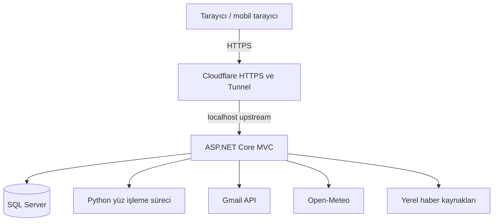
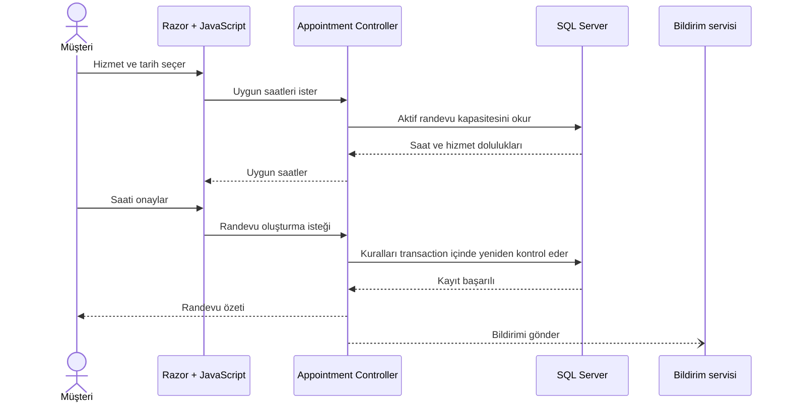
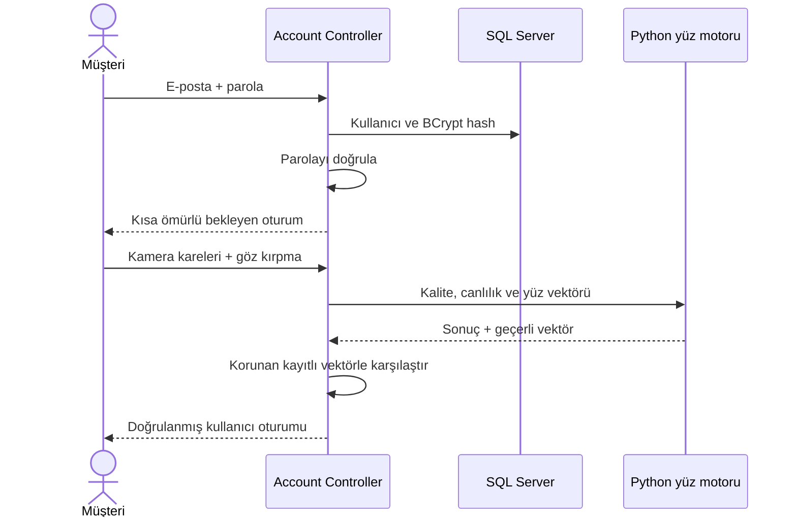

# DryCar Care mimarisi

Bu belge, ürünün nasıl çalıştığını kod ayrıntısına boğulmadan anlatır. Public depo kurulabilir production kaynaklarını içermez; buradaki şemalar canlı sistemde kullandığım sınırları ve sorumlulukları gösterir.

## Sistem sınırı

Kestrel doğrudan internete açılmıyor. Public istek Cloudflare üzerinden gelip yalnız loopback adresinde dinleyen uygulamaya aktarılıyor. Gizli değerler publish klasöründe veya GitHub deposunda değil, çalışma ortamının korumalı yapılandırmasında tutuluyor.

## Randevu oluşturma akışı

Tarayıcıdaki uygunluk kontrolü yalnız kullanıcı deneyimini hızlandırır. Asıl kapasite kuralı yazma sırasında sunucuda tekrar çalışır. Böylece iki kişinin aynı anda gördüğü boş saat için çakışan kayıt üretmesi engellenir.

Uygulanan temel kurallar:

- Aynı saate en fazla iki aktif araç kabul edilir.
- Aynı hizmet aynı saatte yalnızca bir kez rezerve edilebilir.
- Geçmiş saatler ve çalışma saatleri dışındaki seçimler reddedilir.
- Yönetici tarafından oluşturulan randevular da aynı kapasite politikasından geçer.
- Veritabanı indeksi uygulama kontrolünün altında ikinci bir güvenlik ağı oluşturur.

## İki adımlı müşteri girişi

Doğru parola tek başına tam kullanıcı oturumu üretmez. Yüz ve canlılık doğrulaması tamamlanana kadar yalnız bekleyen kullanıcı kimliği tutulur.

## Arka plan işleri ve dış servisler

- Gmail API randevu ve ödül bildirimlerini gönderir.
- E-posta hatası ana randevu transaction’ını geri almaz; kullanıcıya uygulama içi bildirim bırakılabilir.
- Hava durumu ve haber servisleri başarısız olduğunda ana sayfa çalışmaya devam eder.
- Süresi yaklaşan ücretsiz yıkama hakları arka plan worker’ı tarafından kontrol edilir.

## Bilinçli teknik tercihler

| Tercih | Neden |
| --- | --- |
| Server-rendered Razor | Küçük işletme ürünü için hızlı ilk açılış ve daha az frontend karmaşıklığı |
| SQL Server + EF Core | Transaction, ilişki ve indeks gerektiren randevu kuralları |
| Ayrı Python süreci | Yüz işleme kütüphanelerini web katmanından izole etmek |
| Cloudflare Tunnel | Kestrel portunu doğrudan internete açmadan HTTPS yayın |
| Gmail API/OAuth | SMTP parolası saklamak yerine yenilenebilir token yaklaşımı |

